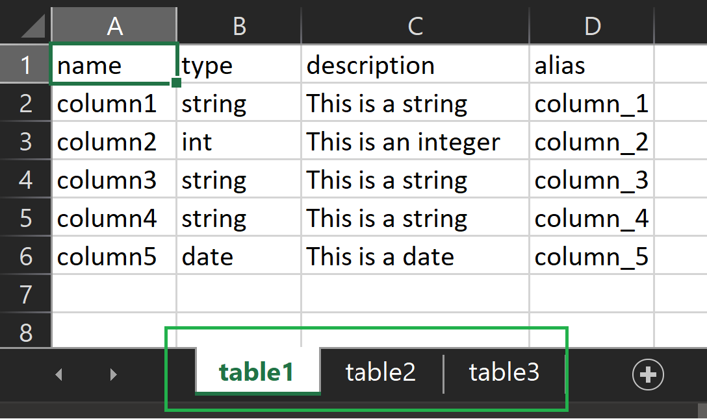

# dbt-starter

### Helps jump start any dbt project

>Note: This library is in a pre-production state.

## Steps

### Installation
```shell
pip install dbtjumpstart
```

### Usage

#### Preparation
You need to create two .xlsx spreadsheets - one that contains all the table configurations and another that contains the details about all the columns in the tables.

##### tables.xlsx
Create _tables.xlsx_ with the following format. You definitely need to have the column headers as is, but you are free to leave them empty. 


##### columns.xlsx
Create a .xlsx spreadsheet in the below format. You definitely need to have the column headers as is, but you are free to leave them empty. 
>Note that you need to name the sheets with the exact table names that you used in the tables.xlsx



#### Python

```python
from dbtjumpstart.main import make_models
make_models(<input_path>, <output_path>)
```
>Note - make sure the output_path already exists.

Once you run it, check the output path, you will find your models and the schema file.

> This project puts the descriptions of the columns and tables in the schema.yml file, does not create a separate markdown file.
> This feature will be added in future releases

## Known issues
- There will be a trailing comma at the end of the last column in the models